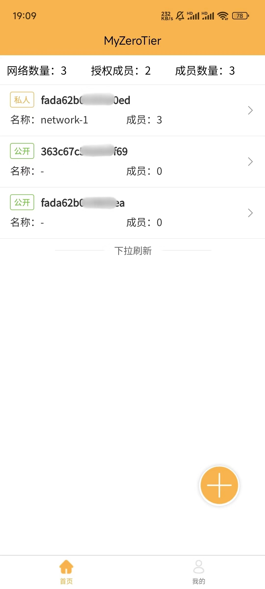
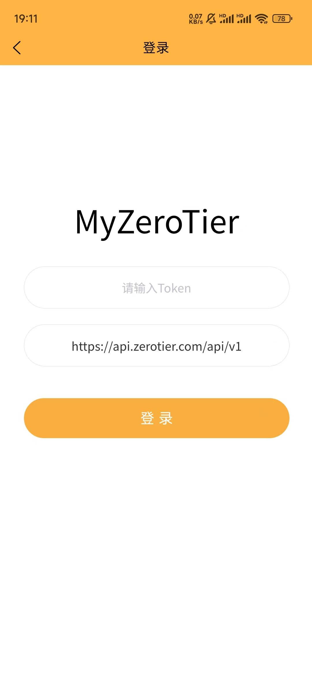
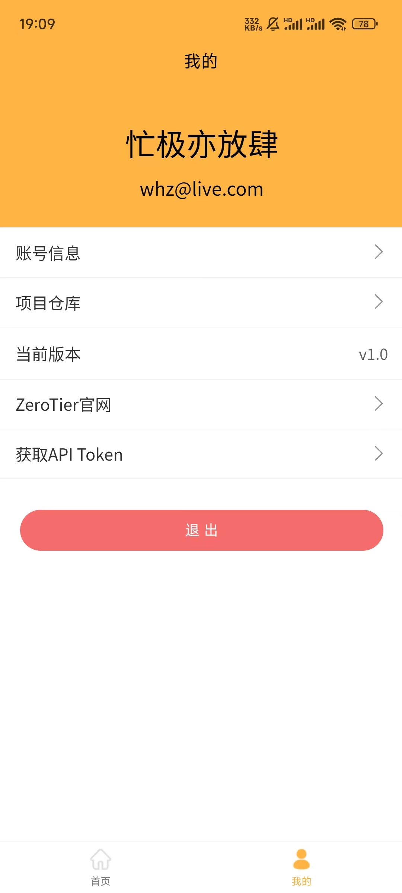
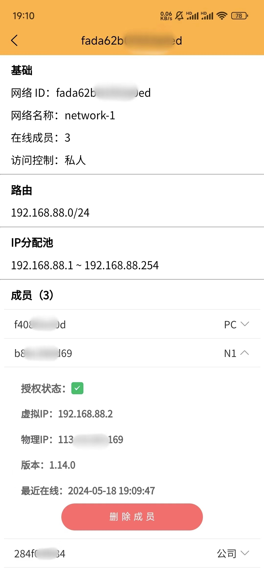
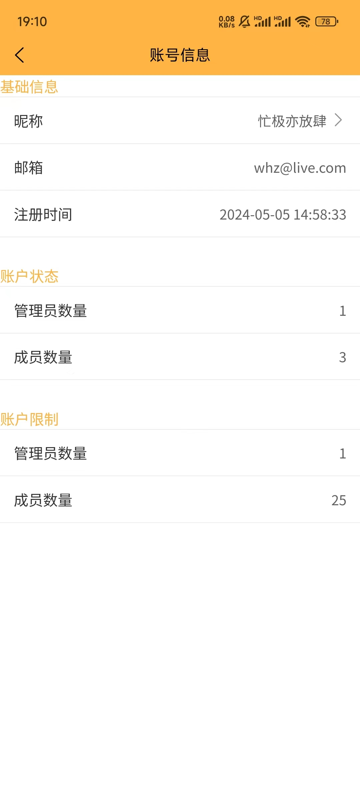

### MyZeroTier
一个可以在安卓移动端管理ZeroTier的应用

### 功能
- [x] 新增、删除、查询网络信息
- [ ] 修改网络设置(IP分配池、路由配置等)
- [x] 查询、删除网络成员
- [x] 对网络成员进行授权或取消授权
- [ ] 添加网络成员
- [x] 修改昵称

### 相关截图

### F&Q
1. 为什么会有这个项目？
    > 因为平时有一些远程的需求用到了ZeroTier来组网，但是有时记不住每个设备的虚拟IP，每次都得登录到官网看一眼，就觉得很麻烦，所以想找一个能在手机查看信息并做相关设置的应用，但是没找到，所以自己开整。
2. 为什么不做成小程序？
    > 因为ZeroTier API的域名没有ICP备案，在本地测试还行，正式版是无法发起请求的。但是也有解决办法，可以自建一个后端服务进行中转一下，但是需要一个备案的域名和公网服务器，而且觉得也没必要这么干，就有了apk。
3. 为什么用uni-app来实现？
    > 因为原生安卓已经不会写了，uni-app还能快速完成我的功能，虽然打出来的包有些大，但15MB还是可以接受的。
4. 如何获取ZeroTier的Token？
    > 查看官网 https://docs.zerotier.com/api/tokens#zerotier-central-token